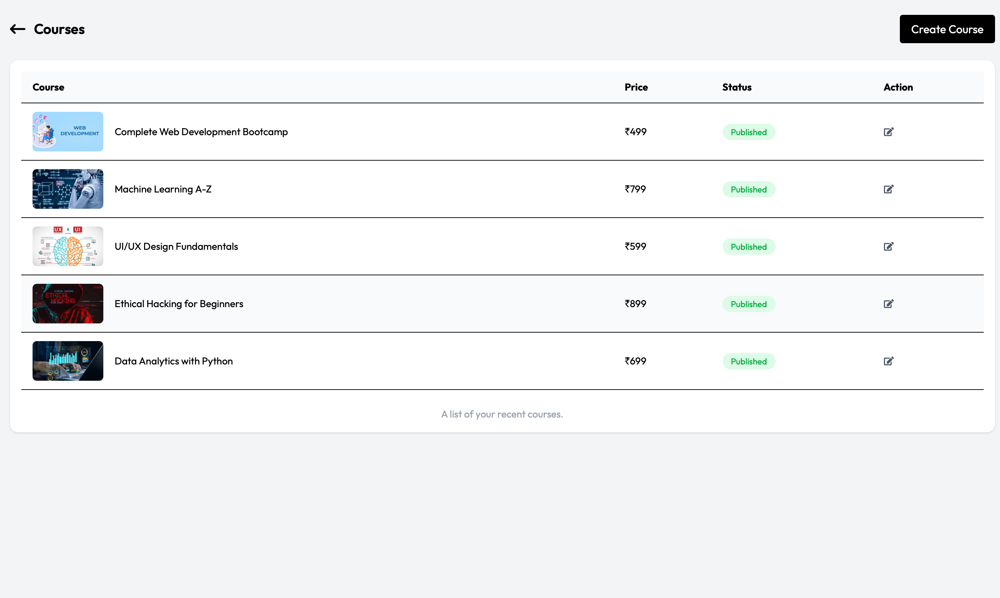
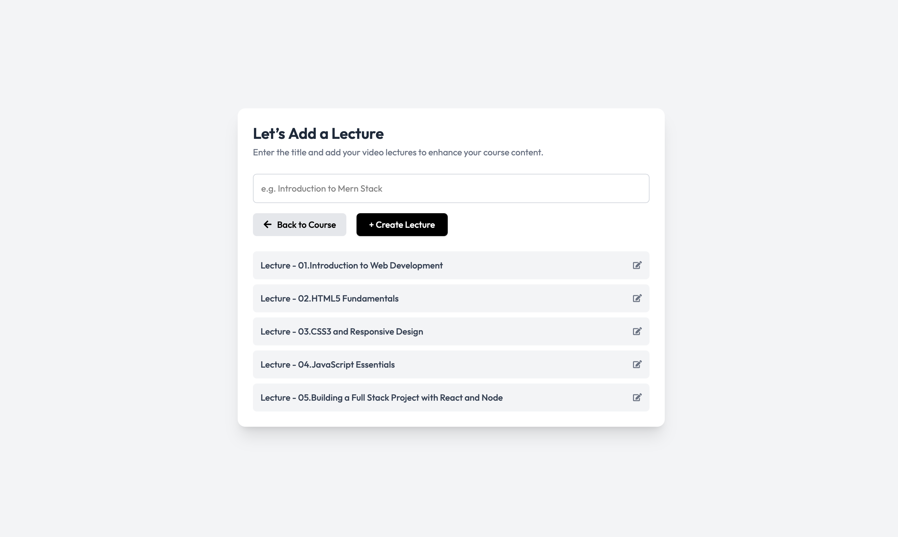
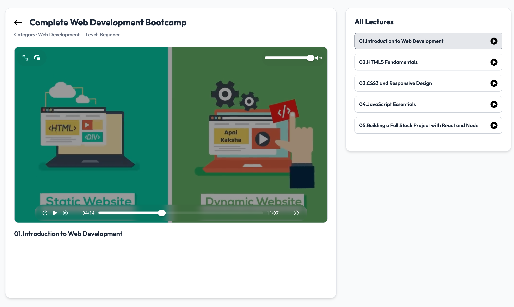

# Virtual Courses

A full-stack AI-powered Learning Management System — educators create and sell video courses, students browse, enroll, and learn, with AI-powered course search.


**Live:** [Frontend](https://virtual-courses-indol.vercel.app) · [Backend API](https://virtualcourses-oga1.onrender.com)


## Features

- Email/password and Google (Firebase) authentication with role-based access — student / educator
- Course and lecture creation with video upload (Cloudinary), including free-preview lectures
- Paid course enrollment via Razorpay, with server-side order verification and amount-tampering protection
- AI-powered course search (Google Gemini) with a Web Speech API voice-search interface
- Course reviews and ratings
- Educator dashboard with earnings and enrollment analytics
- Ownership-based authorization — only a course's creator can edit, publish, or delete it

---

### Sign Up & Login


Email/password or Google sign-in, with a student/educator role picker at signup.

### Educator Course Management



Educators manage their own courses — create, publish/unpublish, edit, and delete.

### Lecture Management



Add lectures to a course, upload video content, and mark specific lectures as free preview.

### Course Detail & Enrollment


Full course detail page with curriculum, requirements, and Razorpay checkout.

### My Enrolled Courses


Students access everything they've purchased from one place.

### Watching Lectures



Enrolled students get full access to every lecture in the course.

---

## Tech Stack

**Frontend** — React, Vite, Redux Toolkit, Tailwind CSS, Axios
**Backend** — Node.js, Express, MongoDB (Mongoose), JWT, Multer
**Integrations** — Razorpay for payments · Google Gemini for AI search · Cloudinary for video/image storage · Firebase for Google auth · Brevo for transactional email
**Deployment** — Vercel (frontend) · Render (backend) · MongoDB Atlas

## Architecture

```
[ React SPA -- Vercel ]  --axios, withCredentials-->  [ Express API -- Render ]
                                                              |---> Cloudinary (video/image CDN)
                                                              |---> Razorpay (payment gateway)
                                                              |---> Google Gemini (AI search fallback)
                                                              v
                                                        [ MongoDB Atlas ]
                                                users / courses / lectures / reviews / orders

[ Browser ] --Firebase SDK (client-side popup)--> [ Google OAuth ] --verified name+email--> backend /googlesignup
```

## Getting Started

### Prerequisites

Node.js v18+, a MongoDB Atlas URI, and API keys for Cloudinary, Razorpay, Google Gemini, Firebase, and Brevo.

### Backend

```
cd backend
npm install
```

Create `backend/.env`:

```
PORT=8000
NODE_ENV=development
MONGODB_URL=your_mongodb_connection_string
JWT_SECRET=your_jwt_secret
CLIENT_URL=http://localhost:5173
CLOUDINARY_CLOUD_NAME=your_cloud_name
CLOUDINARY_API_KEY=your_api_key
CLOUDINARY_API_SECRET=your_api_secret
RAZORPAY_KEY_ID=your_razorpay_key_id
RAZORPAY_SECRET=your_razorpay_secret
GEMINI_API_KEY=your_gemini_api_key
EMAIL=your_email_address
BREVO_API_KEY=your_brevo_api_key
```

```
npm run dev
```

### Frontend

```
cd frontend
npm install
```

Create `frontend/.env`:

```
VITE_SERVER_URL=http://localhost:8000
VITE_FIREBASE_APIKEY=your_firebase_api_key
VITE_RAZORPAY_KEY_ID=your_razorpay_key_id
```

```
npm run dev
```

Frontend: `http://localhost:5173` · Backend: `http://localhost:8000`

## API Reference

| Method | Route | Auth | Purpose |
|---|---|---|---|
| POST | `/api/auth/signup` | Public | Signup (role whitelist enforced) |
| POST | `/api/auth/login` | Public | Login, JWT cookie set |
| POST | `/api/auth/logout` | Public | Cookie clear |
| POST | `/api/auth/googlesignup` | Public | Google login/signup |
| POST | `/api/auth/sendotp` | Public | Forgot-password OTP (Brevo) |
| POST | `/api/auth/verifyotp` | Public | Verify OTP |
| POST | `/api/auth/resetpassword` | Public | Set new password |
| GET | `/api/user/currentuser` | User | Session validity (used on refresh) |
| POST | `/api/user/updateprofile` | User | Update name/description/photo |
| POST | `/api/course/create` | Educator | Create course |
| GET | `/api/course/getpublishedcourses` | Public | List courses (paid videoUrl stripped) |
| GET | `/api/course/getcreatorcourses` | Educator | Educator's own courses |
| POST | `/api/course/editcourse/:id` | Owner | Update course + thumbnail |
| GET | `/api/course/getcourse/:id` | Public | Single course detail |
| DELETE | `/api/course/removecourse/:id` | Owner | Delete course + its lectures |
| POST | `/api/course/createlecture/:id` | Owner | Add lecture to course |
| GET | `/api/course/getcourselecture/:id` | Enrolled/Owner | Full lectures (else preview-only) |
| POST | `/api/course/editlecture/:id` | Owner | Update lecture + video |
| DELETE | `/api/course/removelecture/:id` | Owner | Delete lecture |
| POST | `/api/course/getcreator` | User | Educator public profile info |
| POST | `/api/payment/create-order` | User | Create Razorpay order + Order doc |
| POST | `/api/payment/verify-payment` | User | Verify payment + enroll (amount-checked) |
| POST | `/api/review/givereview` | User | Add review (1–5 rating) |
| GET | `/api/review/allReview` | Public | All reviews (site-wide) |
| GET | `/api/review/course/:id` | Public | Reviews for one course |
| POST | `/api/ai/search` | Public | Hybrid direct-match + AI course search |

## Known Limitations

- No rate limiting yet — especially relevant for the AI search and payment endpoints, which call paid third-party APIs
- `getPublishedCourses` returns the full course list without pagination
- No database indexes beyond the default `_id` (planned: `creator`, `category`+`isPublished` on courses, and a compound `course`+`student` index on orders)
- Only two roles exist (student/educator) — no platform-wide admin/moderation panel
- Deleting a course cascades to its lectures, but not to its reviews (orphaned reviews remain)
- Payment verification is idempotent, but a narrow race window exists if the exact same order's verify endpoint is called twice truly simultaneously — a stricter fix would use an atomic `findOneAndUpdate` filtered on `isPaid:false`
- No automated tests yet

## Roadmap

- [ ] Rate limiting (Redis-based, especially on AI/payment routes)
- [ ] Pagination for course listings
- [ ] Database indexes (`creator`, `category`+`isPublished`, `course`+`student`)
- [ ] Razorpay webhooks as a fallback confirmation path
- [ ] True admin role/panel for platform-wide moderation
- [ ] AI Quiz Generator (originally planned feature for this project)
- [ ] Per-course AI doubt-solving chatbot
- [ ] Automated tests (Jest/Supertest, React Testing Library)
- [ ] CI/CD (GitHub Actions)
